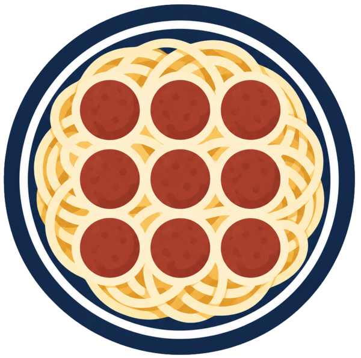

# NoDL - Node Definition Language



NoDL (Node Definition Language) is a schema and toolkit to describe a ROS 2 node's interface: parameters, topics (publishers and subscriptions), services (clients and servers), and actions (clients and servers).

Find complete documentation at https://nodl.readthedocs.io/en/latest/

## Repository structure

- [ament_nodl/](./ament_nodl/): CMake macros to register NoDL documents with the ament index
- [nodl/](./nodl/): Metapackage that pulls in the other packages as dependencies. Acts as an easy default for those who don't want a-la-carte.
  - [doc/](./nodl/doc/): Documentation source for the ReadTheDocs page
- [nodl_schema/](./nodl_schema/): Package providing the NoDL schema, plus a Python package with validation tools and typed data model to work with it.
    [nodl.schema.yaml](./nodl_schema/nodl_schema/schemas/nodl.schema.yaml): The NoDL schema, key to this whole thing!
- [ros2nodl/](./ros2nodl/): `ros2cli` extension providing `ros2 nodl ...` commands
- [tools/](./tools/): Scripts supporting development and build workflows

## Developing

### Setup

1. Clone the repo and install pre-commit hooks:

```bash
pre-commit install
pre-commit install --hook-type prepare-commit-msg
```

The `prepare-commit-msg` hook will automatically add the `Signed-off-by` line to your commits. If you prefer to sign off manually, use `git commit -s`.
