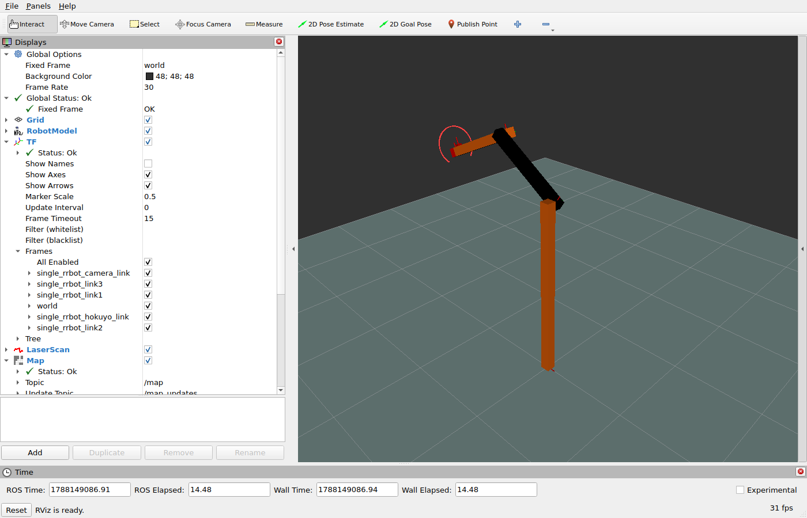

# Dummy robot: preserve a visible system

This tutorial migrates the `dummy_robot` laser interface to NoDL without changing the visible system.

```text
dummy_laser ── /scan (frame_id) ──> RViz
robot_state_publisher ── /tf ─────> RViz
```

> **Launch → Describe → Specify (NoDL) → Generate and implement → Conform and recover**

NoDL owns ROS interface declarations. It does not own scan calculation, timestamps, loop rate, real-time guarantees,
or TF lookup behavior.

## 1. Launch the existing robot

Build the tutorial package and launch its conventional implementation:

```bash
colcon build --packages-up-to nodl_tutorial_dummy_robot
source install/setup.bash
ros2 launch nodl_tutorial_dummy_robot dummy_robot.launch.py interface:=conventional
```

RViz should show the robot and its changing laser scan.
This is the baseline that the generated implementation must preserve.

## 2. Describe the laser interface

In another terminal, recover the interface of the existing `/dummy_laser` node:

```bash
ros2 nodl describe /dummy_laser \
  -o /tmp/dummy_laser.observed.nodl.yaml
```

Check behavior and frame relationships separately:

```bash
ros2 topic echo /scan --once
ros2 run tf2_ros tf2_echo world single_rrbot_hokuyo_link
```

`describe` records the node's ROS interface.
The topic, TF, and RViz checks verify the system behavior that NoDL does not own.

## 3. Specify the NoDL contract

Review the discovered type, name, and quality of service (QoS).
The edited contract drives generation and conformance.

```{literalinclude} ../../../examples/nodl_tutorials/dummy_robot/nodl/dummy_laser.nodl.yaml
:language: yaml
```

Validate the document after editing:

```bash
ros2 nodl validate examples/nodl_tutorials/dummy_robot/nodl/dummy_laser.nodl.yaml
```

## 4. Generate implementation without replacing behavior

Stop the conventional launch and start the generated implementation:

```bash
ros2 launch nodl_tutorial_dummy_robot dummy_robot.launch.py interface:=nodl
```

The generated node preserves the complete visible system:



The package composes the contract with `nodl://rclcpp/node` for C++ generation.
The public contract remains the explicit input to conformance.

### Before and after: replace wiring, preserve behavior

The migration moves the publisher declaration into the generated base.
The existing 30 Hz scan behavior remains ordinary C++.
The conventional implementation is adapted from
[`dummy_sensors/src/dummy_laser.cpp`](https://github.com/ros2/demos/blob/f8d20abaec2be76c7062b2a0242ae6f82e2857b8/dummy_robot/dummy_sensors/src/dummy_laser.cpp).

::::{tabs}
:::{tab} Before: conventional

```{literalinclude} ../../../examples/nodl_tutorials/dummy_robot/cpp/conventional_excerpt.cpp
:language: cpp
```

:::

:::{tab} After: NoDL-forward

```{literalinclude} ../../../examples/nodl_tutorials/dummy_robot/src/dummy_laser_nodl.cpp
:language: cpp
```

:::
::::

The NoDL contract owns the `/scan` name, `LaserScan` type, and QoS.
The handwritten C++ owns scan values, timestamps, and publication timing.

## 5. Conform, regress, and recover

In another terminal, compare the generated implementation with the contract:

```bash
ros2 nodl conform /dummy_laser \
  --file examples/nodl_tutorials/dummy_robot/nodl/dummy_laser.nodl.yaml
```

```text
/dummy_laser: conforms
```

Run each regression separately and leave the NoDL contract unchanged.

::::{tabs}
:::{tab} Topic

```bash
# Terminal 1
ros2 launch nodl_tutorial_dummy_robot dummy_robot.launch.py \
  interface:=regression scan_topic:=scan_regressed
# Terminal 2
ros2 nodl conform /dummy_laser \
  --file examples/nodl_tutorials/dummy_robot/nodl/dummy_laser.nodl.yaml
```

```text
[missing] publishers '/scan': expected type 'sensor_msgs/msg/LaserScan' was not observed
[extra] publishers '/scan_regressed': observed undeclared type 'sensor_msgs/msg/LaserScan'
```

:::

:::{tab} Type

```bash
# Terminal 1
ros2 launch nodl_tutorial_dummy_robot dummy_robot.launch.py \
  interface:=regression scan_type:=point_cloud
# Terminal 2
ros2 nodl conform /dummy_laser \
  --file examples/nodl_tutorials/dummy_robot/nodl/dummy_laser.nodl.yaml
```

```text
[type_mismatch] publishers '/scan': expected 'sensor_msgs/msg/LaserScan', got 'sensor_msgs/msg/PointCloud'
```

:::

:::{tab} Reliability

```bash
# Terminal 1
ros2 launch nodl_tutorial_dummy_robot dummy_robot.launch.py \
  interface:=regression scan_reliability:=best_effort
# Terminal 2
ros2 nodl conform /dummy_laser \
  --file examples/nodl_tutorials/dummy_robot/nodl/dummy_laser.nodl.yaml
```

```text
[qos_mismatch] publishers '/scan': reliability: expected RELIABLE, got BEST_EFFORT
```

The scan may remain visible.
Conformance detects contract drift even when the system appears to work.
:::

:::{tab} Durability

```bash
# Terminal 1
ros2 launch nodl_tutorial_dummy_robot dummy_robot.launch.py \
  interface:=regression scan_durability:=transient_local
# Terminal 2
ros2 nodl conform /dummy_laser \
  --file examples/nodl_tutorials/dummy_robot/nodl/dummy_laser.nodl.yaml
```

```text
[qos_mismatch] publishers '/scan': durability: expected VOLATILE, got TRANSIENT_LOCAL
```

:::

:::{tab} History

```bash
# Terminal 1
ros2 launch nodl_tutorial_dummy_robot dummy_robot.launch.py \
  interface:=regression scan_history:=keep_all
# Terminal 2
ros2 nodl conform /dummy_laser \
  --file examples/nodl_tutorials/dummy_robot/nodl/dummy_laser.nodl.yaml
```

```text
[qos_mismatch] publishers '/scan': history: expected KEEP_LAST, got KEEP_ALL
[unverifiable] publishers '/scan': depth: observed value is unknown
```

:::

:::{tab} Depth

```bash
# Terminal 1
ros2 launch nodl_tutorial_dummy_robot dummy_robot.launch.py \
  interface:=regression scan_depth:=1
# Terminal 2
ros2 nodl conform /dummy_laser \
  --file examples/nodl_tutorials/dummy_robot/nodl/dummy_laser.nodl.yaml
```

```text
[qos_mismatch] publishers '/scan': depth: expected 10, got 1
```

:::
::::

:::{note}
QoS discovery depends on the ROS middleware (RMW) implementation.
If a value cannot be observed, `conform` reports `unverifiable`.
These results were verified on ROS 2 Jazzy with `rmw_cyclonedds_cpp`.
:::

Stop the regression launch, restore the generated implementation, and check it again:

```bash
# Terminal 1
ros2 launch nodl_tutorial_dummy_robot dummy_robot.launch.py interface:=nodl
# Terminal 2
ros2 nodl conform /dummy_laser \
  --file examples/nodl_tutorials/dummy_robot/nodl/dummy_laser.nodl.yaml
```

RViz proves that the system still appears to work.
`conform` proves that its ROS interface still matches the contract.
